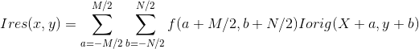
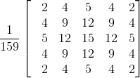

## Projeto de ITP - 2017.2
### Software de Diagnóstico de Catarata

Alunos envolvidos no projeto:
- Felipe C. Ramos Filho
- João Pedro de A. Paula

### Informações sobre o projeto
Neste projeto, iremos implementar um programa em C para analisar 4 imagens (duas
 com catarata e duas sem catarata) e emitir um diagnóstico de cada uma.
O projeto irá ser implementado nas seguintes etapas:

- **Transformação da imagem colorida para tons de cinza**  
   Para converter qualquer cor em seu nível aproximado de cinza, deve-se 
   primeiro obter suas primitivas vermelho, verde e azul (da escala Red Green 
   Blue). Adiciona-se então 30% do vermelho mais 59% do verde mais 11% do azul, 
   independente da escala utilizada (0.0 a 1.0, 0 a 255, 0% a 100%). O nível 
   resultante é o valor de cinza desejado. Tais porcentagens estão relacionadas 
   à própria sensibilidade visual do olho humano para as cores primárias.

- **Segmentação da imagem**  
   A filtragem é um procedimento usual ao realizar o tratamento de uma imagem, 
   antes de que um determinado processamento possa ser feito. De uma forma geral
   a filtragem de imagens é implementada através de uma multiplicação especial 
   entre duas matrizes (operação também chamada de convolução).

*Equação 1: A convolução mencionada*

Na *Equação 1*, *Ires* e *Iorig* representam, respectivamente, a imagem 
resultante após a filtragem e a imagem original a ser filtrada; *Ires*(x,y) e 
*Iorig*(x,y) representam os pixels das imagens nas posições **x** e **y** de 
cada uma. Os valores de **M** e **N** são os tamanhos da matriz **F**, que é o 
filtro a ser aplicado. Existem diversas utilizações para filtragem tais como 
remoção ou adição de ruído na imagem e mudança ou realce de algumas 
características. Neste trabalho iremos aplicar dois filtros na imagem: o 
**Filtro Gaussiano** e o **Filtro de Realce de Arestas**.  

O **filtro gaussiano** é um dos mais comuns em processamento digital de imagens,
pois ele reduz as transições bruscas na imagem (ruídos de alta frequência), 
deixando a imagem mais “suave”. Na prática o filtro gaussiano é implementado 
através da operação de filtragem especificada na Equação 1 usando uma matriz F,
obtida através de uma função gaussiana 2D. Para o nosso caso, usaremos os 
valores para *F* como mostrados na Figura 1, abaixo:

*Figura 1: Matriz de um Filtro Gaussiano*

**Realce de Arestas** é um processo de realce de arestas na imagem. Esse 
processo recebe como entrada uma imagem e produz como saída outra imagem, porém
contendo apenas os contornos da imagem original, em preto e branco. Para muitos
procedimentos que precisam da detecção de figuras geométricas, como círculos, no
nosso caso, é necessário o uso de imagens que contenham apenas os contornos das 
figuras na imagem ao invés dos valores de todos os pixels em RGB. Para tal é 
necessário realizar uma série de procedimentos a fim de garantir a detecção dos
contornos com a melhor qualidade possível.

# English

### Cataract Diagnosis Software

Students involved in the project:
- Felipe C. Ramos Filho
- João Pedro de A. Paula

### Informations about the project
  In this project we have to implement a C program to analyse four images (two
with cataract and two without) and emit a diagnosis of each one of the images.
The project will be implemented in the following steps:

- **Transformation of the colored image to greyscale**  
   To convert any color to its greyscale, we need to obtain its red, green and 
   blue primitives (from the RGB scale). We then add 30% of red, 59% of green 
   and 11% of blue, independent of the scale that's been used (0.0 to 1.0, 0 to 
   255 of 0% to 100%). The result is the desired grey value. Such percentages 
   are related to the human eye's visual sensibility to the primary colors.

- **Image segmentation**  
   The filtering is a usual process when treating an image, before any given
   processing is made. In general, the filtering of images is implemented 
   through a special multiplicaton between two matrixes (also known as 
   convulution).

*Equation 1: The mentioned convolution*

In the *Equation 1*, *Ires* and *Iorig* represent, respectively, the resulting
image after the filtering and the original image to be filtered; *Ires*(x, y)
and *Iorig*(x, y) represent the pixels of the images on the postitinos **x** and
**y** of each one. The values **M** and **N** are the sizes of the matrix **F**,
which is the filter to be applied. There are a variety of uses for the
filtering, such as removal and addition of noise in the image and changing some
characteristics. In this project we will apply two filters in the image: the
**Gaussian Filter** and the **Edge Enhancement Filter**.

The **Gaussian Filter** is one of the most common in digital processing of
images, because it reduces rough transitions on the image (high frequency
noises), smoothering the image. On practice, the **Gaussian Filter** is
implemented through the filtering operation specified in *Equation 1*, using a
mtrix obtained through a 2D gaussian function. In our case, we will use the
values of *F* as shown in *Figure 1*:

*Figure 1: Matrix of a Gaussian Filter*

The **Edge Enhancement** is a process that receives as input a image and outputs
another image, but containing only the contour of the original image, in black
and white. For many procedures that need the detection of geometric figures,
like circles, in our case, it is necessary the use of images that contain only
the contour of the figures through the values of all pixels in RGB. It is
necessary to realize a series of procudures in order to assure the detection of
the contour with the best quality possible.

